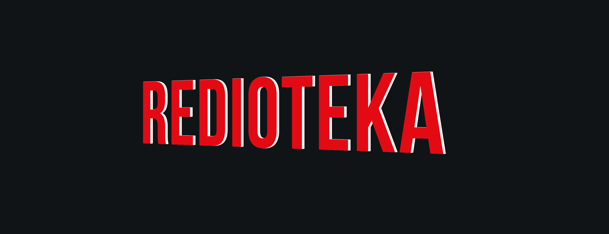
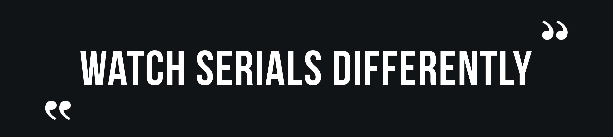

# Netflix project by Red Tech command

  

# Redioteka

## Описание

Redioteka — это стриминговый сервис, позволяющий смотреть интересующие фильмы и сериалы зарегестрированным пользователям. У всех пользователей есть возможность оформить подписку на интересующий их контент. А также оставлять оценки, подбирать фильмы и сериалы по жанрам и актерам.

Вы можете смотреть сколько угодно фильмов и сериалов без рекламы по фиксированной цене!

  

## Программные решения

**Frontend:** JavaScript, node.js, npm

**Backend:** Golang, PosgreSQL

**Плюшки:** 

<ol> 
  <li>?</li>
</ol>

## Как запустить проект

(Добавить позже)

## Демо

[redioteka.com](https://www.netflix.com/ru/)

## Команда 
- Фуллстек
    - [Григорий Будкин](https://github.com/GregoryBS)
    - [Никита Волков](https://github.com/VolkovNik)
    - [Антон Тимонин](https://github.com/timoninas)
    - [Павел Чеклин](https://github.com/paulnopaul)

## Менторы
- Фронтенд
    - [Елизавета Добрянская](https://github.com/Betchika99)
- Бэкенд
    - [Екатерина Кириллова](https://github.com/K1ola)

